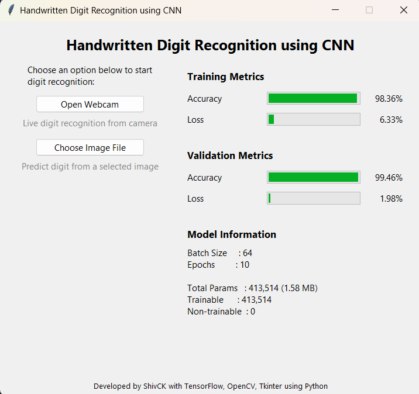
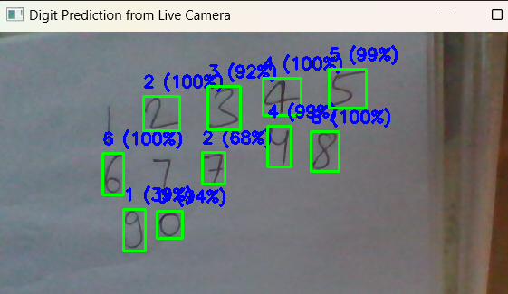
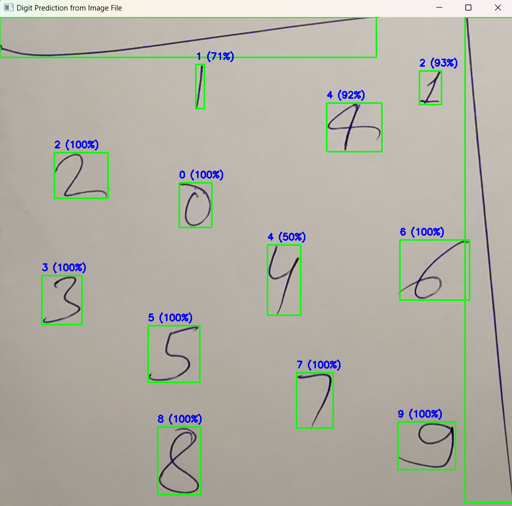
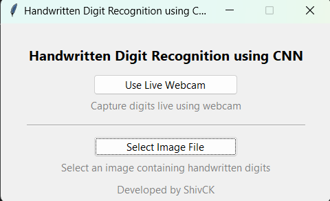

# Handwritten Digit Recognition using Convolutional Neural Networks (CNN)

## Overview



This repository contains an implementation of a **Convolutional Neural Network (CNN)** for recognizing handwritten digits (0–9). The system supports:

* Real-time digit recognition using a **webcam**  

* Prediction from **static image files**  

* Simple **GUI-based interaction** for ease of use  


The project demonstrates the application of deep learning in image classification, specifically focused on handwritten digit recognition.


## Project Context

This codebase is part of an academic project report submitted to **IGNOU** for the completion of the course:

**MMTP1 – M.Sc. (MACS Programme)**

**Submitted by:**
Shivcharan Kushawah  
Enrollment Number: 2301155104

**Supervised by:**
Dr. D. S. Sachan  
Assistant Professor, now Principal  
St. Mary's PG College, Vidisha, Madhya Pradesh


## Features

* CNN-based digit classification
* Live prediction using webcam feed
* Image file-based prediction
* Minimal and detailed GUI options
* Modular prediction functions for reuse

## Usage

### 1. GUI-based Execution

Run either of the following scripts for a graphical interface:

* Minimal GUI:

  ```
  python gui-minimal.py
  ```

* Detailed GUI:

  ```
  python app-detailed.py
  ```

### 2. Programmatic Usage

You can directly use the prediction functions from `predict.py`:

```python
from predict import predict_from_webcam, predict_from_image_file

predict_from_webcam()
predict_from_image_file("path_to_image")
```

## Requirements

### Software

* Python 3.x

### Python Libraries

* `tensorflow`
* `opencv-python`
* `tkinter` (recommended for GUI)

Install dependencies using:

```
pip install tensorflow opencv-python
```

## Hardware (Optional but Recommended)

* Webcam (for real-time digit recognition)


## Notes

* Ensure proper lighting and clear digit visibility when using webcam input.
* Image inputs should ideally contain one or many digits (Latin 0 to 9)
* Performance depends on the quality of training data and preprocessing.

